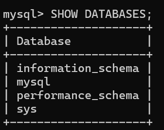

# 常用的 SQL 语句（MySQL 运行）
## 一、库操作（创建 / 查看 / 使用数据库）
### 建一个数据库
sql
CREATE DATABASE mydb;
### 看有哪些库
```sql
SHOW DATABASES;
```
MySQL 安装后自带以下四个系统数据库，非自定义业务库，主要用于管理 MySQL 自身运行，一般不要手动修改或删除：



- information_schema：元数据字典，存储数据库、表、列等所有对象的结构信息，为虚拟库，只读，用于查询结构。
- sql：核心系统库，存储用户账号、权限、日志等核心配置，是 MySQL 正常运行的基础，勿直接修改表。
- performance_schema：性能监控库，收集服务器运行时性能数据（慢查询、资源占用等），用于调优和故障排查。
- sys：易用封装库，对前两个系统库做了视图封装，让性能数据更易读，简化运维查询。
### 进入这个库
```sql
USE mydb;
```
### 删除库
```sql
DROP DATABASE mydb;
```
## 二、表操作（建表 / 看表 / 删表）
### 建一张最简单的表
```sql
CREATE TABLE student(
  id INT PRIMARY KEY AUTO_INCREMENT,
  name VARCHAR(20),
  age INT
);
```
### 看有哪些表
```sql
SHOW TABLES;
```
### 看表结构
```sql
DESC student;
```
### 删除表
```sql
DROP TABLE student;
```
## 三、增（往表里加数据）INSERT
#### 加一条数据
```sql
INSERT INTO student(name,age) VALUES('沈长泽',19);
```
### 一次加多条
```sql
INSERT INTO student(name,age) VALUES('单鸣',18),('白新羽',20);
```
## 四、查（看数据）SELECT
### 查全部
```sql
SELECT * FROM student;
```
### 只查名字
```sql
SELECT name FROM student;
```
### 条件查：年龄 = 18
```sql
SELECT * FROM student WHERE age=18;
```
### 模糊查：名字带 “沈”
```sql
SELECT * FROM student WHERE name LIKE '%沈%';
```
### 排序：按年龄从大到小（ASC 为升序，DESC 为降序）
```sql
SELECT * FROM student ORDER BY age DESC;
```
## 五、改（更新数据）UPDATE
### 注意：一定要加 WHERE 条件，否则全表数据会被修改
把单鸣的年龄改成 20：
```sql
UPDATE student SET age=20 WHERE name='单鸣';
```
## 六、删（删除数据）DELETE
### 删年龄 = 20 的数据：
```sql
DELETE FROM student WHERE age=20;
```
## 七、数据分析常用
### 统计一共多少人
```sql
SELECT COUNT(*) FROM student;
```
### 求平均年龄
```sql
SELECT AVG(age) FROM student;
```
### 最大年龄（最小年龄用 MIN）
```sql
SELECT MAX(age) FROM student;
```
### 年龄总和
```sql
SELECT SUM(age) FROM student;
```
### 按年龄分组统计
```sql
SELECT age, COUNT(*) FROM student GROUP BY age;
```
## 八、用户 / 账户操作（MySQL 管理员常用）
### 看当前用户
```sql
SELECT USER();
```
### 创建新用户
```sql
CREATE USER 'testuser'@'localhost' IDENTIFIED BY '123456';
```
### 给这个用户所有权限
```sql
GRANT ALL ON *.* TO 'testuser'@'localhost';
```
### 刷新权限
```sql
FLUSH PRIVILEGES;
```
### 删除用户
```sql
DROP USER 'testuser'@'localhost';
```
## 九、最简单的全流程实战
```sql
CREATE DATABASE test;
USE test;
CREATE TABLE user(
  id INT PRIMARY KEY AUTO_INCREMENT,
  name VARCHAR(20),
  score INT
);
INSERT INTO user(name,score) VALUES('小明',90),('小红',85),('小刚',99);
SELECT * FROM user;
SELECT AVG(score) FROM user;
SELECT MAX(score) FROM user;
UPDATE user SET score=100 WHERE name='小明';
DELETE FROM user WHERE score<90;